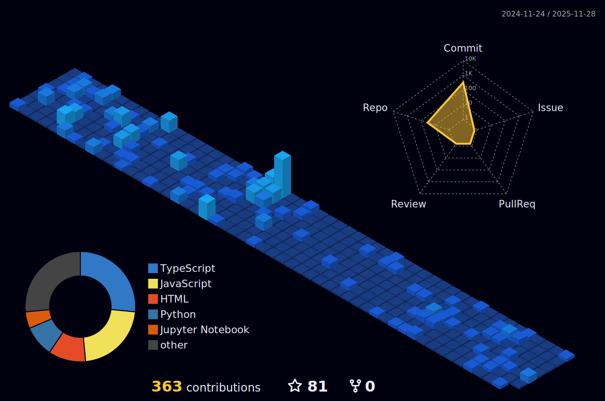

# Hello there! 👋

### Bio:

S.N.V.S.KOMAL is a talented software engineer with a strong passion for  Python, Frontend, and Backend development.
            

### Streetcred:

### 

### Links:

### <a href="https://www.github.com/shanmukavenkat">github</a>

## 👇 Few things about me

            

### summary
*S.N.V.S.KOMAL is a talented software engineer with a strong passion for Java, Python, Frontend, development.*

            

<i>Generated by <a href="https://www.tublian.com/"></i>

           
# 💫 About Me:
I'm currently working on  data analytics I'm looking to collaborate on Full stack developer I'm looking for help with backend I'm currently learning data analytics Once I commit to it, I carry it out

# 📊 GitHub Stats:
 
 

## 🏆 GitHub Trophies

### 🔝 Top Contributed Repo

---
<!-- Proudly created with GPRM ( https://gprm.itsvg.in ) -->

 

