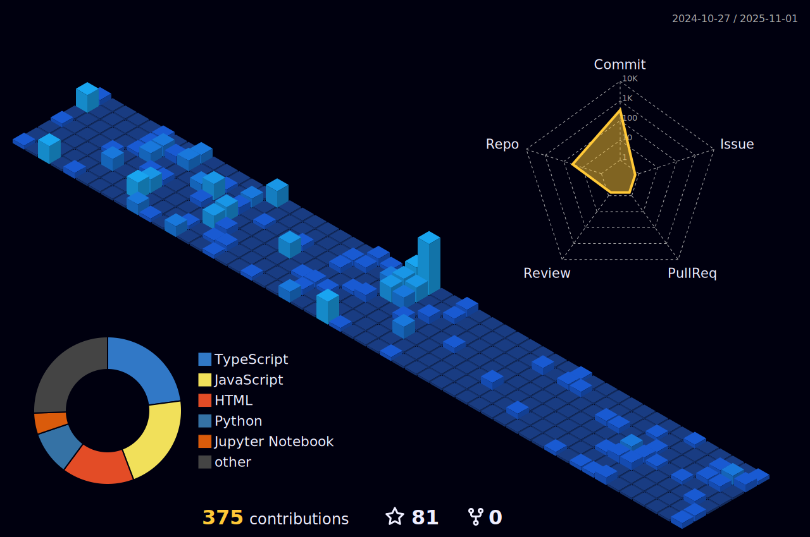

# Hello there! 👋


### Bio:

I’m a MERN Developer passionate about UI/UX design, Data Science, and Power BI, crafting smart and seamless experiences 🚀

## 🚀 About Me
- 🔭 I'm currently working on **Data Analytics**
- 🤝 I'm looking to collaborate on **Full Stack Development**
- 🛠️ I'm looking for help with **Backend Development**
- 📚 I'm currently learning **Data Analytics**
- 🎯 Once I commit to something, I **carry it out with full dedication**

### Streetcred:

<a href="https://www.tublian.com/profile/shanmukavenkat?ss=true"></a>


##
In your terminal:
```bash
npm i snvskomal
npx snvskomal
```


### <a href="https://www.github.com/shanmukavenkat">github</a>

<h2 align="left">🛠️ Languages and Tools</h2>


<p align="center">
<i>Generated by <a href="https://www.tublian.com/"></i>
</p>
           


# 📊 GitHub Stats:

<p align="center">
  
  
  
</p>

## 🏆 GitHub Trophies


### 🔝 Top Contributed Repo


<a href="https://github.com/shanmukavenkat">
  
</a>


---
<!-- Proudly created with GPRM ( https://gprm.itsvg.in ) -->
[](https://visitcount.itsvg.in)


<p align="center">
 
</p>
